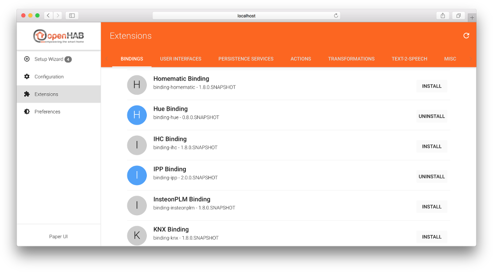
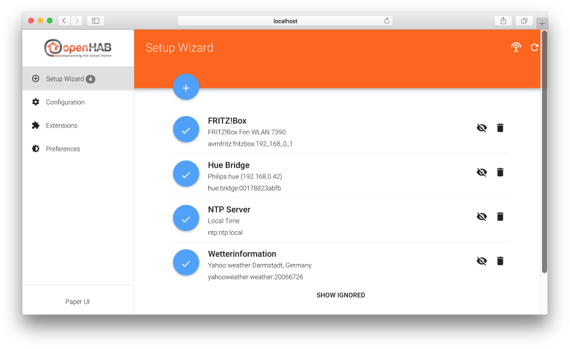
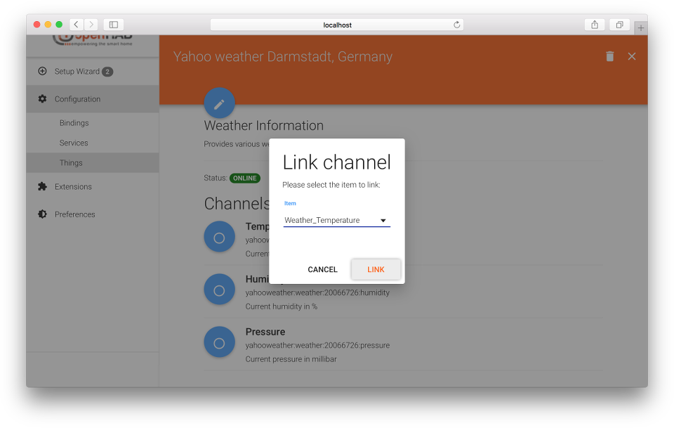

# Paper UI

The Paper UI is a new interface that helps setting up and configuring your openHAB instance.
It does not (yet) cover all aspects, so you still need to resort to textual configuration files, but it already offers the following:

 - Add-on management: Easily install or uninstall openHAB add-ons

 - Thing discovery: See devices and services found on your network and add them to your setup.

- Linking items to channels: Instead of adding a binding configuration to your item file, you can directly link Thing channels to your items.

Note that you still need to define your items, sitemaps, persistence configurations and rules in the according config files (as done in openHAB 1). Such functionality will be added bit by bit to the Paper UI only.

Here you can find a small screencast about the Paper UI:

