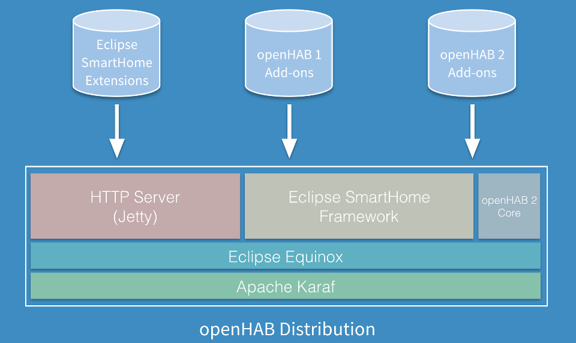

# Introduction to openHAB 2

openHAB is a software for integrating different home automation systems and technologies into one single solution that allows over-arching automation rules and that offers uniform user interfaces.

openHAB 2 is the successor of [openHAB 1](https://github.com/openhab/openhab/wiki). It is an open-source solution based on the [Eclipse SmartHome]() framework. It is fully written in Java and uses [Apache Karaf](http://karaf.apache.org/) together with [Eclipse Equinox](https://www.eclipse.org/equinox/) as an OSGi runtime and bundles this with [Jetty](https://www.eclipse.org/jetty/) as an HTTP server.

openHAB is a highly modular software, which means that the base installation (the "runtime") can be extended through "add-ons". The openHAB distribution includes add-ons from different sources and makes them all available.

Note that the openHAB distribution repository does not contain any source code, but it rather aggregates features from different repos:
 - [Eclipse SmartHome Framework](https://github.com/eclipse/smarthome): This repo holds the major parts of the core functionality.
 - [openHAB 2 Core](https://github.com/kaikreuzer/openhab-core): This repo contains a few small bundles that are not part of Eclipse SmartHome, but required for the openHAB runtime. This e.g. contains a compatibility layer for supporting openHAB 1 add-ons.
 - [openHAB 2 Add-ons](https://github.com/openhab/openhab2): Add-ons of openHAB that use the Eclipse SmartHome APIs can be found within this repository. They cannot be used with an openHAB 1.x runtime, since they provide features that the old runtime does not support.
 - [openHAB 1 Add-ons](https://github.com/openhab/openhab): Add-ons developed for openHAB 1.x. Most of them are working smoothly on the openHAB 2 runtime and thus they are packaged within the distribution. 
 - [Eclipse SmartHome Extensions](https://github.com/eclipse/smarthome/tree/master/extensions): Since openHAB uses the Eclipse SmartHome framework, it is automatically compatible with all extensions that are available for it and maintained within the Eclipse SmartHome repository. These are usually high-quality extensions that might be even used in commercial products.
 
